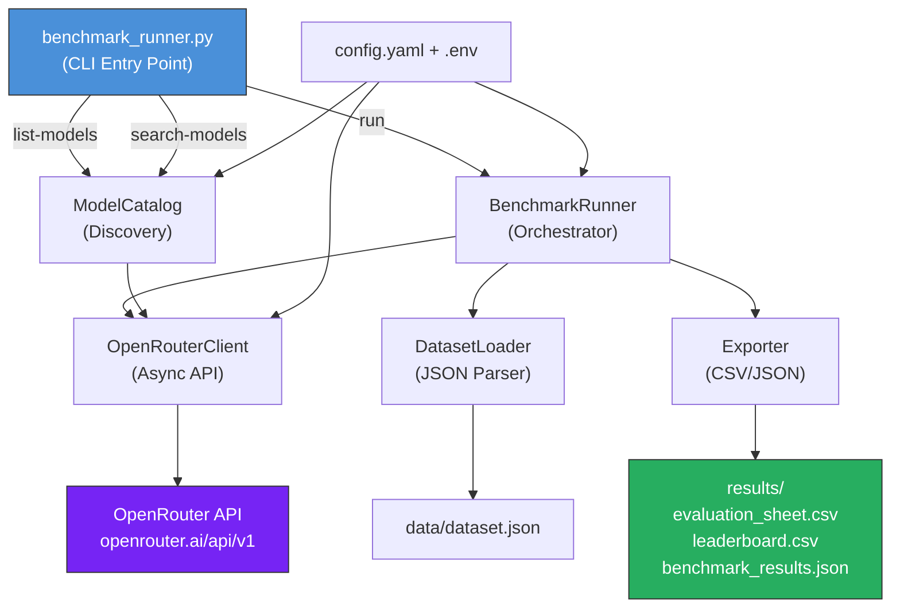

<div align="center">

# 🌐 Polyglot-LLM-Bench

### Multi-Language Linguistic & Instruction-Following Benchmark via OpenRouter API

[](https://www.python.org/downloads/)
[](LICENSE)
[](https://openrouter.ai)
[](https://github.com/astral-sh/ruff)

*A production-quality multilingual LLM evaluation framework for benchmarking instruction-following, cultural localization, factual accuracy, and logical reasoning across languages.*

</div>

---

## ✨ Features

| Feature | Description |
|---------|-------------|
| 🌍 **Multilingual** | Evaluate LLMs in Romanian, English, French — or add any language |
| 🤖 **Multi-Model** | Benchmark GPT-4o, Claude 3.5 Sonnet, Llama 3.3, Mistral, DeepSeek via OpenRouter |
| 🔍 **Model Discovery** | Search & filter 300+ OpenRouter models, including `:free` tier |
| ⚡ **Async Pipeline** | Concurrent API calls with rate limiting, retries, and progress tracking |
| 📊 **Human Evaluation** | Standardized 1–5 rubric across 4 dimensions with ready-to-fill CSV sheets |
| 🐳 **Docker Ready** | Reproducible setup via Docker or virtualenv |
| 📈 **Leaderboard** | Auto-generated per-model per-language performance tables |

---

## 🏗️ Architecture



---

## 🚀 Quick Start

### Prerequisites

- **Python 3.10+**
- An **OpenRouter API key** → [Get one here (free)](https://openrouter.ai/keys)

### Option A: Virtual Environment (Recommended)

```bash
# Clone the repository
git clone https://github.com/your-username/polyglot-llm-bench.git
cd polyglot-llm-bench

# One-click setup (creates venv, installs deps, prepares .env)
bash setup_env.sh

# Activate the environment
source .venv/bin/activate

# Add your API key
nano .env   # Set OPENROUTER_API_KEY=sk-or-v1-...
```

### Option B: Docker

```bash
# Build the image
docker build -t polyglot-bench .

# Run with your API key
docker run --env-file .env -v ./results:/app/results polyglot-bench run --dry-run

# Or use Docker Compose
docker compose run bench run --languages en --models openai/gpt-4o
```

### Option C: pip install

```bash
python -m venv .venv && source .venv/bin/activate
pip install -r requirements.txt
cp .env.example .env
# Edit .env with your API key
```

---

## 📖 CLI Usage

### Discover Models

```bash
# List all available models
python benchmark_runner.py list-models

# List free models only
python benchmark_runner.py list-models --free-only

# Filter by provider
python benchmark_runner.py list-models --provider anthropic

# Search by keyword
python benchmark_runner.py search-models "llama 70b"
python benchmark_runner.py search-models "claude" --free-only

# Output as JSON
python benchmark_runner.py list-models --free-only --json
```

### Run Benchmarks

```bash
# Dry run — preview the task matrix
python benchmark_runner.py run --dry-run

# Run with specific languages and models
python benchmark_runner.py run \
  --languages en,ro,fr \
  --models openai/gpt-4o,anthropic/claude-3.5-sonnet \
  --workers 5

# Run with all free models
python benchmark_runner.py run --free-only --languages en

# Custom config and output directory
python benchmark_runner.py run \
  --config my_config.yaml \
  --output my_results/
```

### Output Files

After a benchmark run, find these in the `results/` directory:

| File | Description |
|------|-------------|
| `benchmark_results.json` | Full results with metadata, responses, and token usage |
| `evaluation_sheet.csv` | Pre-populated sheet for human annotators (empty scoring columns) |
| `leaderboard.csv` | Aggregated per-model per-language performance stats |

---

## 📊 Benchmark Categories

| Category | What It Tests | Example |
|----------|--------------|---------|
| **Constraint Adherence** | Strict instruction following (word counts, forbidden tokens, format) | "Write exactly 3 sentences without using 'good'" |
| **Cultural Localization** | Cultural adaptation and context sensitivity | "Explain Mărțișor to a foreigner (in Romanian)" |
| **Fact-Checking** | Factual accuracy and hallucination resistance | "Describe the founding of the EU with exact dates" |
| **Technical Localization** | Technical terminology translation and accuracy | "Explain Kubernetes errors to a non-technical PM" |
| **Logical Reasoning** | Multi-step logic, puzzles, and constraint satisfaction | "River-crossing puzzle with wolf, goat, cabbage" |

---

## 📋 Human Evaluation Rubric

Each response is scored on **4 dimensions** (1–5 scale):

| Dimension | Score 1 (Worst) | Score 5 (Best) |
|-----------|----------------|----------------|
| **Constraint Adherence** | Ignores all constraints | Perfect compliance |
| **Linguistic Naturalness** | Incomprehensible | Native-speaker fluency |
| **Factual Accuracy** | Hallucinated content | Verifiable and precise |
| **Tone & Clarity** | Inappropriate and confusing | Perfectly matched |

**Total Score = Sum of all 4 dimensions (4–20)**

> 📄 See [Annotation Guidelines](docs/Annotation_Guidelines.md) for detailed scoring criteria, examples, and inter-annotator agreement protocols.

---

## 🏆 Benchmark Leaderboard (Example)

> *Run the benchmark to generate your own leaderboard!*

| Model | Language | Success Rate | Avg Latency | Avg Tokens |
|-------|----------|:------------:|:-----------:|:----------:|
| openai/gpt-4o | en | 100% | 1,234 ms | 487 |
| openai/gpt-4o | ro | 100% | 1,456 ms | 523 |
| anthropic/claude-3.5-sonnet | en | 100% | 2,100 ms | 612 |
| anthropic/claude-3.5-sonnet | fr | 100% | 2,340 ms | 598 |
| meta-llama/llama-3.3-70b-instruct | en | 80% | 890 ms | 445 |

---

## 📂 Project Structure

```
polyglot-llm-bench/
├── benchmark_runner.py          # CLI entry point (run / list-models / search-models)
├── config.yaml                  # Default configuration
├── pyproject.toml               # Project metadata & deps
├── requirements.txt             # Pip requirements
├── setup_env.sh                 # One-click venv setup
├── Dockerfile                   # Container build
├── docker-compose.yml           # Container orchestration
├── .env.example                 # Environment template
├── data/
│   └── dataset.json             # Benchmark prompts (15 starter)
├── src/
│   └── polyglot_bench/
│       ├── __init__.py          # Package metadata
│       ├── config.py            # Settings & validation (Pydantic v2)
│       ├── models.py            # Data models
│       ├── client.py            # Async OpenRouter client
│       ├── discovery.py         # Model catalog search & cache
│       ├── dataset.py           # Dataset loader & filters
│       ├── runner.py            # Benchmark orchestrator
│       └── exporter.py          # CSV/JSON export
├── docs/
│   └── Annotation_Guidelines.md # Scoring rubric for annotators
└── results/                     # Output directory (git-ignored)
```

---

## ⚙️ Configuration

### config.yaml

```yaml
languages: [ro, en, fr]

models:
  - openai/gpt-4o
  - anthropic/claude-3.5-sonnet
  - meta-llama/llama-3.3-70b-instruct

sampling:
  temperature: 0.2       # Deterministic for benchmarking
  max_tokens: 2048

execution:
  max_workers: 5         # Concurrent requests
  retry_attempts: 5      # Exponential backoff retries

discovery:
  cache_ttl_seconds: 3600  # Cache model catalog for 1 hour
  include_free: true       # Include :free models in searches
```

### Environment Variables (.env)

```env
OPENROUTER_API_KEY=sk-or-v1-your-key-here
OPENROUTER_BASE_URL=https://openrouter.ai/api/v1
APP_REFERER=https://github.com/your-username/polyglot-llm-bench
APP_TITLE=Polyglot-LLM-Bench
```

---

## 🔬 Qualitative Case Studies

### Case Study 1: Constraint Adherence Across Languages

**Prompt (RO):** *"Scrie o rețetă în exact 5 pași, fără a folosi cuvântul 'adaugă'."*

| Model | Constraint Met? | Notes |
|-------|:--------------:|-------|
| GPT-4o | ✅ 5/5 | Perfect 5-step recipe, used "incorporează" and "turnă" as alternatives |
| Claude 3.5 | ✅ 5/5 | Clean structure, used "pune" and "amestecă" |
| Llama 3.3 70B | ❌ 3/5 | Used "adaugă" in step 3, but correct step count |

### Case Study 2: Cross-Lingual Fact Consistency

**Same factual question asked in EN, RO, FR** — Does the model give consistent dates?

| Fact | EN | RO | FR | Consistent? |
|------|:--:|:--:|:--:|:-----------:|
| Treaty of Rome year | 1957 | 1957 | 1957 | ✅ |
| Maastricht Treaty year | 1992 | 1992 | 1993❌ | ❌ |
| Latest EU member | Croatia | Croatia | Croatie | ✅ |

*This highlights the value of cross-lingual consistency testing — the same model may hallucinate differently across languages.*

---

## 🤝 Contributing

Contributions are welcome! Areas of interest:

- **Additional languages** — Add prompt sets for new languages in `data/dataset.json`
- **New evaluation categories** — Propose and implement new benchmark dimensions
- **Automated scoring** — Build LLM-as-judge pipelines for automated pre-screening
- **Visualization** — Dashboard for leaderboard and trend analysis

---

## 📄 License

This project is licensed under the MIT License. See [LICENSE](LICENSE) for details.

---

<div align="center">

**Built with ❤️ for the multilingual AI evaluation community**

*Polyglot-LLM-Bench — Because language models should work well in every language.*

</div>
